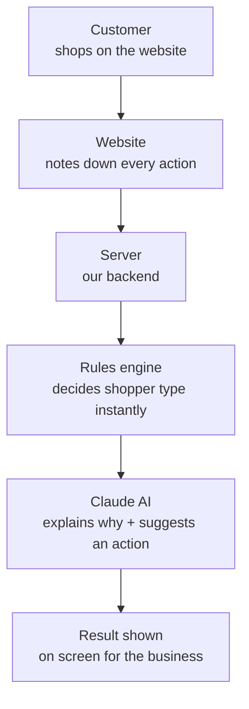

# Signal — Ecommerce Personalization Rules Engine

A small tool that looks at what a shopper does on a website, the pages they
open, the products they view, whether they add things to cart, whether they
search for discount codes, and figures out **what kind of shopper they are**.
It also explains *why*, and suggests what the website should do about it.

## What problem does this solve?

Every visit to a shopping website leaves a trail of actions:

- opened the homepage
- looked at a product for 40 seconds
- added something to the cart
- searched for a discount code
- left without buying

This tool reads that trail and sorts the shopper into one of 5 simple types:

| Type | What it means |
|---|---|
| **Browser** | Just looking around, no real interest yet |
| **Comparer** | Looking at several similar products, still deciding |
| **Discount seeker** | Wants a coupon before they'll buy |
| **Cart abandoner** | Added items to cart but didn't finish the purchase |
| **Loyal customer** | Has bought before and is buying again |

For each shopper, the tool shows:
1. **Which type** they are
2. **How sure** it is (a confidence score)
3. **Why** it thinks so (the evidence)
4. **What the website should do** about it (e.g. show a discount popup, send a cart-recovery reminder)

## How it works — the flow



The important thing to notice: **step D (rules engine) does not use AI at
all.** It's plain code doing simple math — that's what makes it instant.
**Step E is the only place AI (Claude) is used** — and even there, it isn't
deciding anything. It's just turning the decision into plain, human language
and suggesting an action.

## Why split it into "rules engine" + "AI" like this?

This is the main design decision in the project, and worth understanding well:

- The shopper type has to be decided **fast** and **the same way every
  time**. If a customer adds an item to cart, the site should react
  instantly — not wait a few seconds for an AI to think about it.
- AI models are great at understanding and explaining things in natural
  language, but they're slower, cost money per use, and can answer slightly
  differently each time you ask.

So the work is split:
- **Rules engine** (plain code) → makes the decision, instantly, every time the same way.
- **Claude AI** → only explains the decision and suggests an action, in plain English.

This is how real personalization systems are usually built — a fast,
predictable system makes the live decision, and AI is used where its
strength actually matters: language and reasoning, not split-second,
repeatable decisions.

## What is an "event stream"?

It's just a list of things a shopper did, in order, with a timestamp on
each one. For example:

```json
[
  { "type": "product_view", "category": "sneakers", "durationSec": 25 },
  { "type": "add_to_cart", "price": 89 },
  { "type": "checkout_start" }
]
```

The rules engine reads this list, counts things up (how many products
viewed, how many times added to cart, whether checkout was started but no
purchase happened, and so on), and scores all 5 shopper types. Whichever
type scores highest wins.


## Website layout

Two panels side by side. Left = edit events. Right = see the result.

```
--------------------------------------------------
| Signal - shopper state console                 |
--------------------------------------------------
| SESSION SIMULATOR      | CLASSIFICATION         |
|                        |                         |
| [session buttons]      | State: Cart Abandoner   |
|                        | Confidence: 99%         |
| event list             |                         |
|  - product_view        | scores for all 5 types  |
|  - add_to_cart         |                         |
|  - checkout_start      | evidence bullets        |
|                        |                         |
| [add event form]       | Claude's explanation    |
|                        | recommended action      |
--------------------------------------------------
```

Left side = `SessionPicker.jsx` + `EventTimeline.jsx`. You pick a sample
session or start blank, then add/remove events.

Right side = `ClassificationPanel.jsx`. Shows the state, confidence, scores,
evidence, and Claude's explanation + recommended action.

Left side updates the right side instantly for the state/confidence, and
after ~700ms for Claude's explanation.


## Project structure

```
personalization-engine/
├── backend/                  Node.js + Express — the server
│   ├── server.js             Starts the server
│   └── src/
│       ├── mockData.js       5 sample shopper sessions, for testing
│       ├── classifier.js     The rules engine — decides the shopper type
│       ├── llmExplainer.js   Calls Claude — explains the decision
│       └── routes/api.js     The API endpoints (the "doors" the frontend talks to)
└── frontend/                 React (Vite) — what you see on screen
    └── src/
        ├── App.jsx                     Ties everything together
        └── components/
            ├── SessionPicker.jsx       Pick a sample shopper or start blank
            ├── EventTimeline.jsx       Add/remove actions live (the simulator)
            └── ClassificationPanel.jsx Shows the result: type, confidence, evidence, action
```

### What each file actually does

- **`mockData.js`** — Since we don't have a real website connected, this
  file creates 5 fake shoppers (one of each type) so we can test the tool.

- **`classifier.js`** — The core logic. First it turns the raw event list
  into numbers (how many cart adds, how many failed coupon tries, etc.).
  Then it scores each of the 5 shopper types based on those numbers, and
  picks the highest score. This file never calls AI — it's just math.

- **`llmExplainer.js`** — Takes the decision `classifier.js` already made
  and sends it to Claude with a clear instruction: "explain this, don't
  change it." Claude replies with a short explanation and a suggested
  action.

- **`routes/api.js`** — Defines the URLs the frontend can call:
  - `GET /api/sessions` → get the 5 sample shoppers
  - `POST /api/classify` → send an event list, get back the shopper type (fast, no AI)
  - `POST /api/explain` → send the decision, get back Claude's explanation (uses AI)

- **`server.js`** — Starts everything up and listens for requests on port 4000.

- **`App.jsx`** — Runs `/api/classify` the instant you change an event (so
  it feels live), and waits 700 milliseconds before calling `/api/explain`
  — so Claude isn't called on every single click, only after you pause.

- **`EventTimeline.jsx`** — This is the simulator. You can add or remove
  actions (like "added to cart" or "tried a coupon code") and watch the
  shopper type change in real time.

- **`ClassificationPanel.jsx`** — Displays the result: the shopper type, a
  confidence bar, the evidence behind the decision, and Claude's
  explanation + suggested action.

## Tech used, and why

| Tool | Why it's used here |
|---|---|
| **Node.js** | Lets us run JavaScript on the server, same language as the frontend |
| **Express** | A simple way to build the API on top of Node.js |
| **React** | Updates the screen automatically when data changes — needed for the live simulator |
| **Vite** | Runs and builds the React app; much faster than older tools, changes show up instantly while coding |
| **Claude API (Anthropic)** | Turns the rules engine's decision into a plain-English explanation and suggestion |

## Running it

**Backend**
```bash
cd backend
npm install
cp .env.example .env        # add your ANTHROPIC_API_KEY
npm start                   # runs on http://localhost:4000
```

**Frontend**
```bash
cd frontend
npm install
npm run dev                 # runs on http://localhost:5173
```

Open `http://localhost:5173`, pick a sample shopper (or start blank), add or
remove actions in the simulator, and watch the shopper type update live.

## Bonus feature: live simulator

The event list is fully editable. Add a failed coupon try and watch the
shopper shift toward "discount seeker". Add "add to cart" + "checkout
started" without a "purchase" and watch it shift toward "cart abandoner" —
all live, with the confidence bar and scores for all 5 types updating
instantly as you type.

## Possible next steps (not built yet)

- Connect to a real website instead of sample data
- Track a shopper across multiple visits, not just one session
- Test the suggested actions with real users and feed results back into the rules
